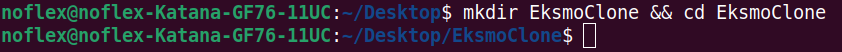
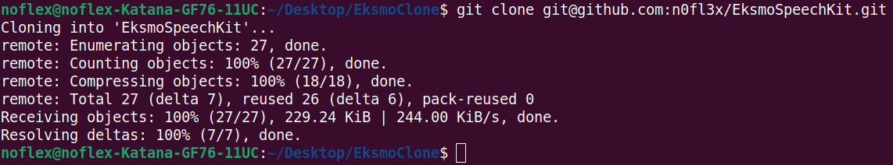
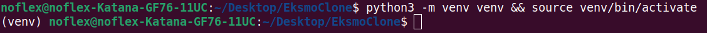
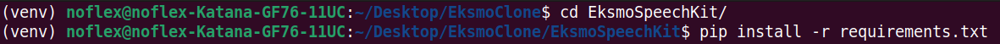
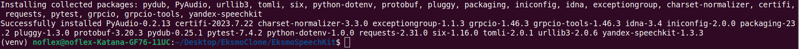
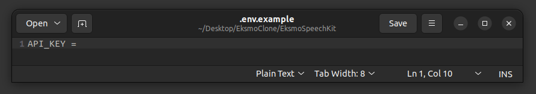
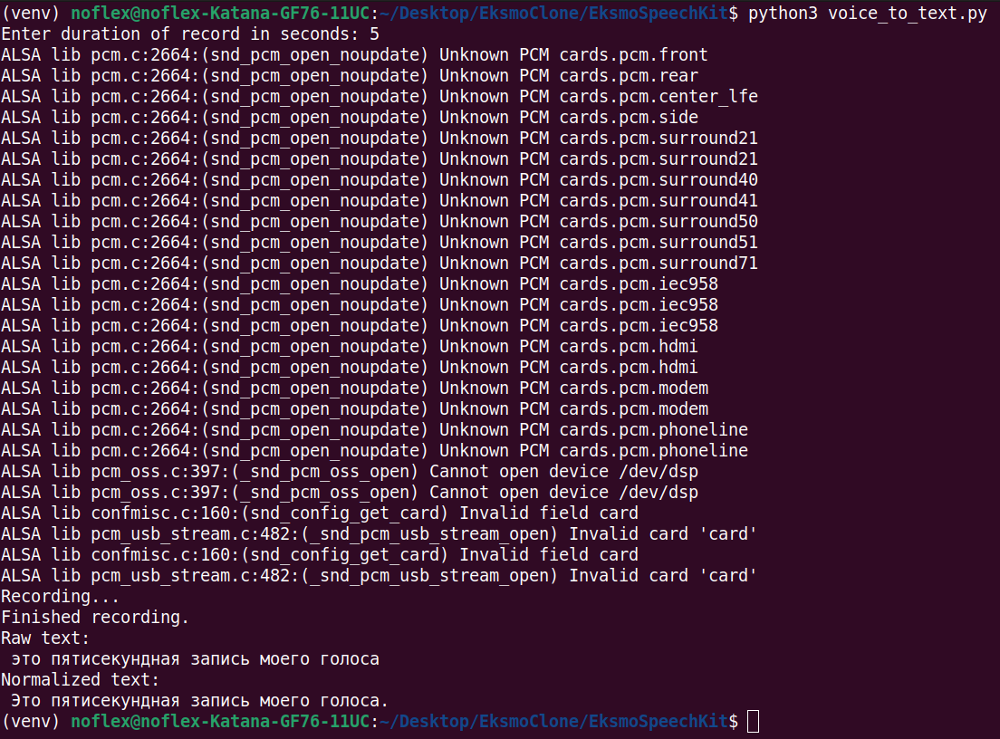
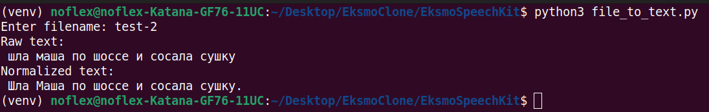

## Eksmo & Yandex SpeechKit
___

### Техническое задание

Вашему отделу поступила задача:

Разработать приложение для интерактивной панели,
с помощью которого вводимый пользователем текст озвучивает персонаж мультфильма.

Необходимо разработать серверную архитектуру для приложения, которое будет использовать открытое API
асинхронного распознавания https://cloud.yandex.ru/docs/speechkit/stt/api/transcribation-api

Описание задачи:

1. На серверной стороне должна быть реализована возможность распознавания голосовых сообщений с помощью
API асинхронного распознавания.
2. Приложение должно иметь возможность записывать голосовые сообщения в режиме реального времени
и отправлять их на сервер для распознавания.
3. Приложение должно иметь возможность распознавать голосовые сообщения, сохраненные в формате аудиофайла,
и выводить результат на экран.

Требования к реализации:

1. Для работы приложения необходимо получить API-ключ от сервиса API асинхронного распознавания.
2. Приложение должно предоставлять пользователю возможность записи голосовых сообщений и
отправки их на сервер для распознавания.
3. Приложение должно иметь возможность распознавания голосовых сообщений в формате аудиофайла.
4. Приложение должно выводить результат распознавания голосовых сообщений на экран/консоль.
5. Код должен быть выложен на GitHub и содержать инструкцию по запуску приложения.
___

### Инструкция по запуску

Т.к. данный проект был реализован на ОС Ubuntu,
то все нижеприведённые манипуляции и команды будут актуальны именно для неё.

- Открываем окно терминала и создаём директорию,
в которую в последствии будем клонировать проект (в данной инструкции "EksmoClone") и переходим в неё:

> mkdir EksmoClone && cd EksmoClone

- Клонируем проект из репозитория GitHub по ссылке:

> git clone git@github.com:n0fl3x/EksmoSpeechKit.git

- Создаём и активируем виртуальное окружения для проекта (в данной инструкции "venv"):

> python3 -m venv venv && source venv/bin/activate

- Переходим в директорию проекта, содержащую файл с описанием необходимых зависимостей и устанавливаем их:

> cd EksmoSpeechKit && pip install -r requirements.txt

- Далее, Вам необходимо получить API-ключ для сервисного аккаунта yandex Cloud.
Информацию о том, как это сделать Вы можете найти по ссылке:
https://cloud.yandex.ru/docs/iam/operations/api-key/create

- Полученный API-ключ необходимо добавить в файл ".env". Есть 2 способа это сделать:
1. В директории "EksmoSpeech" создать файл ".env" и заполнить его, используя в качестве примера
файл ".envexample", который находится там же.
2. Переименовать файл из ".envexample" в ".env" и вставить в него Вам API-ключ.

___

## Распознавание аудио

- Чтобы запустить запись аудио с помощью микрофона (не забудьте убедиться что он включен!) с последующим
распознаванием Вы можете с помощью терминала, находясь в директории "EksmoSpeechKit", запустить скрипт
"voice_to_text.py" с помощью команды:

> python3 voice_to_text.py

А затем указать длительность записи аудио.

Записанные Вами аудио сохраняются в директорию "audio" под названием с ткущей датой и временем в формате ".wav"

- Чтобы запустить распознавание текста из готового аудио-файла, добавьте нужный Вам файл в директорию "audio",
а затем, с помощью терминала, находясь в директории "EksmoSpeechKit", запустите скрипт
"file_to_text.py" с помощью команды:

> python3 file_to_text.py

После укажите название Вашего файла.

